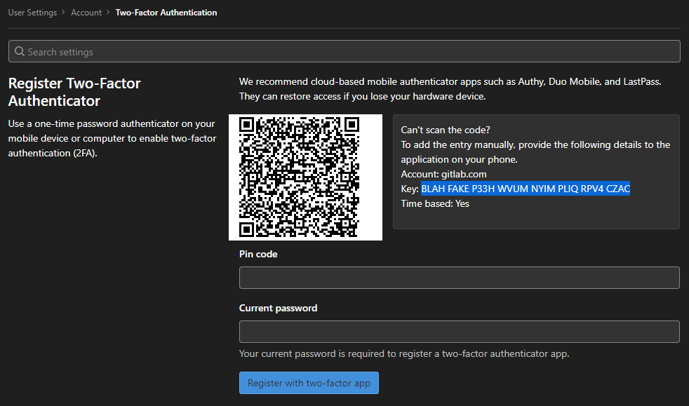
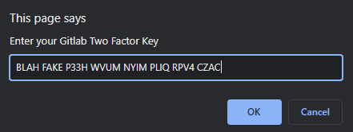

# 20220202
Surprise for Sushi!

# Instructions:

## Installation
[First install a user script manager such as Tampermonkey.](https://greasyfork.org/en) 

[Then Install this script from Greasyfork.](https://greasyfork.org/scripts/39084-surprise-for-sushi)

## Usage
Go to your gitlab profile/account page:

Copy the 2FA Key.

(You may have to disable the previous two-factor authentication and set up a new one.)

Log out of your gitlab account, then log in again.
On the 2FA token page, a prompt should pop up asking you to enter your 2FA key.

You only have to do this once, and for all future logins your 2FA token will be automatically filled!